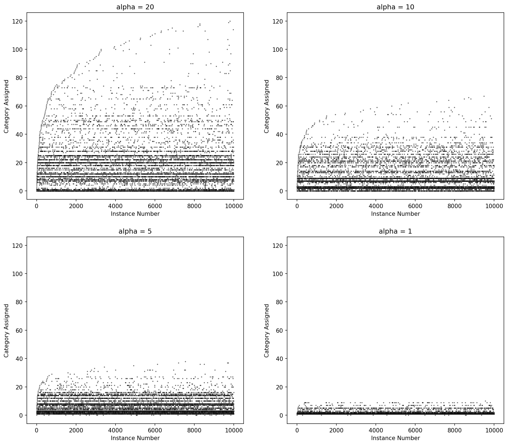

# Prior Processes

In Lace (and in Bayesian nonparametrics) we put a prior on the number of parameters. This *prior process* formalizes how instances are distributed to an unknown number of categories. Lace gives you two options

- The one-parameter Dirichlet process, `DP(α)`
- The two-parameter Pitman-Yor process, `PYP(α, d)`

The Dirichlet process more heavily penalizes new categories with an exponential fall off while the Pitman-Yor process has a power law fall off in the number for categories. When d = 0, Pitman-Yor is equivalent to the Dirichlet process.

**Figure**: Category ID (y-axis) by instance number (x-axis) for Dirichlet process draws for various values of alpha.

Pitman-Yor may fit the data better but (and because) it will create more parameters, which will cause model training to take longer.

**Figure**: Category ID (y-axis) by instance number (x-axis) for Pitman-Yor process draws for various values of alpha and d.

For those looking for a good introduction to prior process, [this slide deck](https://www.gatsby.ucl.ac.uk/~ywteh/teaching/probmodels/lecture5bnp.pdf) from Yee Whye Teh is a good resource.
